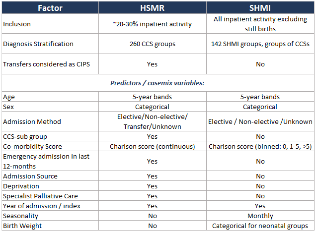
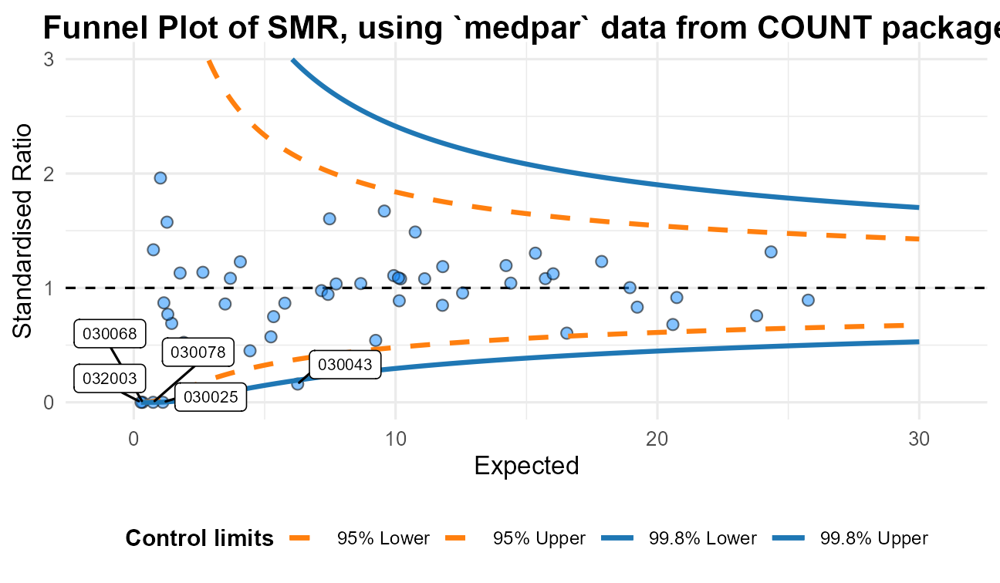
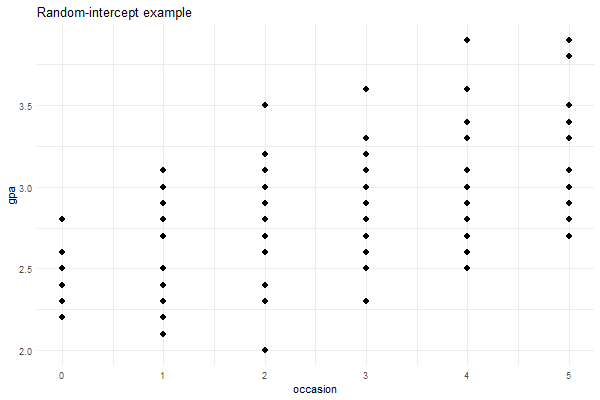
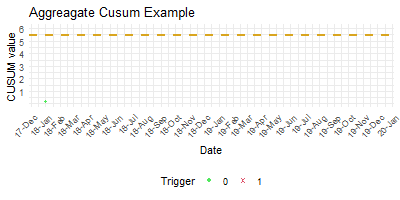
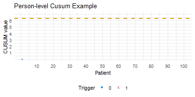

```{r setup, include=FALSE}
library(ragg)
library(RefManageR)
library(NHSRdatasets)
library(tidyverse)
library(scales)
library(FunnelPlotR)
library(COUNT)

options(htmltools.dir.version = FALSE)
BibOptions(check.entries = FALSE, bib.style = "authoryear", style = "html",
           dashed = FALSE, cite.style="authoryear", longnamesfirst=FALSE,
           bibpunct=c("(",")","[", "]",";", ","), first.inits = TRUE, max.names=3)

file.name <- system.file("Bib", "References.bib", package = "RefManageR")
bib <- ReadBib("References.bib")

data("medpar")
data("LOS_model")
#LOS_model <- rbind(LOS_model, LOS_model)

knitr::opts_chunk$set(
	echo = TRUE,
	fig.height = 3.5,
	fig.retina = 3,
	#fig.showtext = TRUE,
	fig.width = 9,
	message = FALSE,
	warning = FALSE,
	cache = FALSE,
	dev = "ragg_png",
	hiline = TRUE,
	out.width = "100%"
)


my_theme <- readRDS("theme.rds")
theme_set(my_theme)

```

```{r R-Lang, echo=FALSE}
# Choose the language at the beginning of your script or knit from external file
lang <- c("EN", "FR")[1]
```

class: title-slide


## Understanding Standardised Mortality Ratios (SMRs)

<br>
.pull-left[

### SHMI and HSMR


<br><br><br><br>

###   Dr Chris Mainey

`r icons::icon_style(icons::fontawesome("twitter"), fill = "#005EB8")` [@chrismainey](https://twitter.com/chrismainey)
`r icons::icon_style(icons::fontawesome("github"), fill = "#005EB8")` [chrismainey](https://github.com/chrismainey)
`r icons::icon_style(icons::fontawesome("linkedin"), fill = "#005EB8")`  [chrismainey](https://www.linkedin.com/in/chrismainey/)
`r icons::icon_style(icons::fontawesome("orcid"), fill = "#005EB8")` [0000-0002-3018-6171](https://orcid.org/0000-0002-3018-6171)
`r icons::icon_style(icons::fontawesome("globe"), fill = "#005EB8")` [www.mainard.co.uk](https://www.mainard.co.uk)
]

.pull-right[

<br><br>

```{r funnel, echo=FALSE, fig.height=3.5, fig.width=6}
mod1 <- glm(died ~ los + factor(type) + age80, data=medpar, family = "binomial")
#summary(mod1)

medpar$pred <- predict(mod1, type="response")

a<-funnel_plot(medpar$died, medpar$pred, medpar$provnum, 
            draw_adjusted = FALSE, draw_unadjusted = TRUE 
            , x_range = c(0,30), y_range=c(0,3)
            , title = "Funnel Plot of SMR, using `medpar` data from COUNT package" )
plot(a) + theme(plot.title = element_text(size=11))

```
]

.footnote[Presentation and code available: **https://github.com/chrismainey/understanding_standardised_mortality**]

???

Say hi - introduce myself

I'm Patient Safety Lead - System Analysis and Delivery with NHS England and Improvement. 

I'm analyst by background, specialised in statistical modelling and and machine learning methods.  My previous role was with UHB - HED, providing HES-based analytical tools to ~50 NHS trust and other organisations. Specialised in statistical productions, mainly risk adjustment and prediction focused.

Today we are going to talk about monitoring mortality, the construction of standardised ratios, the common SMRs in use SHMI and HSMR, cross-sectional and longitudinal monitoring, and issues.

A bit of theory, a bit of anecdote.  Some R scripts available to show some of the functions.


---

# Measuring death

### Why do we do it?

+ 'Smoke alarm for the quality of care' - `r Citep(bib, "keoghKeoghReviewHospital2013")`
+ Tacit assumption that high mortality is bad

--

### Does it work?

+ __Yes:__ 
  + Increases power of comparison by reducing confounding.
  + Monitoring them has effects on hospital's vigilance and culture `r Citep(bib, "jarmanMonitoringChangesHospital2005", "wrightLearningDeathHospital2006")`

+ __No:__ 
  + Poor proxy of avoidable death: `r Citep(bib, "girlingCasemixAdjustedHospital2012")`
  + Case-mix adjustment can exaggerate biases it tries to address: `r Citep(bib, "deeksEvaluatingNonrandomisedIntervention2003")`


--

#### Desceptive argument:
_"...of course we should be monitoring deaths"_ but that's too simple, and it's not a direct measure of 'quality.'


---
class: inverse middle

# Crude Mortality


---
# Crude mortality

.pull-left[

+ Count the numbers of deaths?   - Not a rate
{{content}}
]

.pull-right[
```{r crudeplot, echo=FALSE}
total_p <- LOS_model %>% 
  summarise(p = sum(Death) / n()) %>% 
  pull()
  
LOS_model %>% 
  group_by(Organisation) %>% 
  summarise(p = sum(Death) / n(),
            sum(Death),
            n = n()) %>% 
  mutate(cilower = p - (1.96 * sqrt((p * (1-p)) / n)),
         ciupper = p + (1.96 * sqrt((p * (1-p)) / n))) %>% 
  ggplot(aes(y=p, x=Organisation))+
  geom_point(size=2)+
  geom_errorbar(aes(ymin=cilower, ymax=ciupper))+
  geom_hline(yintercept=total_p, col="red")+
  labs(title = "Trust-level crude mortality (%), taken from `LOS_model` in NHSRdatasets package"
     , y = "Crude mortality rate (proportion)"
     , x = "Trust")+ 
  theme(text = element_text(size=9), plot.title = element_text(size=16),
        axis.title = element_text(size=11))

```

```{r crudetime, echo=FALSE}
data("ae_attendances")
time_p <- ae_attendances %>% 
  filter(org_code == "RQM", type == 1, period < as.Date("2018-04-01")) %>% 
  summarise(prop_breaches = sum(breaches) / sum(attendances)) %>% 
  pull()

ae_attendances %>% 
  filter(org_code == "RQM", type == 1, period < as.Date("2018-04-01")) %>% 
  mutate(prop_breaches = breaches / attendances,
         cilower = prop_breaches - (1.96 * sqrt((prop_breaches * (1-prop_breaches)) / attendances)),
         ciupper = prop_breaches + (1.96 * sqrt((prop_breaches * (1-prop_breaches)) / attendances))) %>% 
  ggplot(aes(y=prop_breaches, x=period))+
  geom_point(size=2)+
  geom_errorbar(aes(ymin=cilower, ymax=ciupper))+
  geom_hline(yintercept=time_p, col="red")+
  scale_y_continuous(labels = label_percent(accuracy=1))+
  scale_x_date(date_labels = "%b-%y", date_breaks = "4 month")+
  labs(title = "A&E 4hr wait breaches (%), taken from `ae_attendance` in NHSRdatasets package"
       , y = "Percentage of 4hr breaches"
       , x = "Time period")+ 
  theme(text = element_text(size=9), plot.title = element_text(size=16),
        axis.title = element_text(size=11))

```
]

--

+ Give it some sort of scale:  proportion
  + In hospital, patients, discharges, bed-days etc.
  + Often adjusted to a larger standard, e.g. per thousand

$${Crude\ Rate(p)} = \frac{\Sigma Deaths}{n}$$

{{content}}
--

+ __Strengths:__
 + Easy to calculate
 + Directly linked to real deaths
 
{{content}}
--

+ __Weaknesses:__
 + Not really comparable across organisations
 + Case-mix confounds rate

---
class: inverse middle

# Standardising mortality
### Aim: reduce confounding and increase power of comparison

---
# Direct standardisation

+ Take our data and map them to a common population/structure.

+ Example:  Age-standardisation:
  + Calculate age-specific rates in groups (e.g. 10-year)
  + Identify a relevant standard population in corresponding groups. E.g. [European Standard Population]( https://www.opendata.nhs.scot/dataset/standard-populations)
  + Multiply age-specific rates by standard population bins
  + Sum and adjust to desired multiplier (e.g. per 100, per 100,000 etc.)

+ Commonly used in public health cases, such as cancer incidence and mortality rates.

--
+ __Strengths:__
 + Directly comparable between units/group/sites/countries
 + Does not require statistical model
 

--

+ __Weaknesses:__
 + Harder to relate to local/observed numbers
 + Challenging to do for anything more than age and sex

---
# Indirect standardisation

+ Compare our data to expected averages

+ E.g. using simple average as standard
 + Calculate average rate, per patient, across the dataset
 + Per trust, calculate 'expected rate': $average\ rate * n$

+ Commonly uses a regression model
  + Predict risk of event, based on case-mix factors (predictors)
  + Present as grouped ratios of Observed / Predicted


+ __Strengths:__
 + Directly comparable between units/group/sites/countries
 + Usually require statistical model, e.g. regression
 
{{content}}
--

+ __Weaknesses:__
 + Usually requires a statistical model, e.g. regression to calculate 'expected rate'
 + Susceptible to more forms of bias `r Citep(bib, "iezzoniRisksRiskAdjustment1997","deeksEvaluatingNonrandomisedIntervention2003",.opts = list(max.names=2))`
 + Can be challenging to understand what changes in rate mean
 
#### This is how SHMI and HSMR are constructed.

---
## Example SMR:
.pull-left[
```{r SMRexample, eval=FALSE}
# Load 'medpar' dataset from COUNT package.
data("medpar")

# build logistic regression for risk of death
mod1 <- glm(died ~ los + factor(type) + age80
            , data=medpar
            , family = "binomial")

# Predict risk of death back into data frame.
medpar$pred <- predict(mod1, type="response")

# SMRs
medpar %>% 
  group_by(provnum) %>% 
  summarise(Observered = sum(died),
            Expected = sum(pred),
            SMR = sum(died) / sum(pred))
```
]

.pull-right[
```{r SMRexample-out, ref.label="SMRexample", echo=FALSE}
```
]

__SMR = 1: observed=predicted,  >1: observed>predicted, <1: observed <predicted__
---
class: inverse middle
# Common SMRs:

### Summary Hospital-level Mortality Indicator (SHMI) 

### Dr Foster Hospital Standardised Mortality Ratio (HSMR)

---
## Hospital Standardised Mortality Ratio (HSMR)

+ Work in USA in as early as 1970s demonstrated ability to calculate theses metrics.

+ Prof. Sir Brian Jarman and others adapted these methods to English health care system, data coding standards and structures

+ Methods were heavily impacted and applied in aftermath of Bristol and Mid-Staffs enquiry.

+ Controversy on some issues:
  + Commercial exploitation of method by Dr Foster Intelligence  - accused of 'black box methods'
  + University of Birmingham and others published criticism
  + Imperial rebutted criticism, and won NIHR funding to build national monitoring system
  + Until recently, sent alerts to CQC and trusts for high mortality.
  
__Key References:__
+ Original paper: `r Citep(bib, "jarmanExplainingDifferencesEnglish1999")`
+ Birmingham's criticism: `r Citep(bib, "mohammedEvidenceMethodologicalBias2009")` 
+ Paul Taylor's long-form article on history and controversy: `r Citep(bib, "taylorStandardizedMortalityRatios2014")`

---
## Summary Hospital-level Mortality Indicator (SHMI)

With growing controversy, then NHS Medical Director, Prof. Sir Bruce Keogh, commissioned a review.

--

Recommended creating a new, NHS owned and transparently published indicator, however:
+ Changed the remit to in-hospital or within 30-days of discharge
+ Applied to all acute activity (except still birth)
+ Cruder case-mix model deliberately to avoid controversial measure such as:
  + Palliative care coding
  + No adjustment for deprivation - political context
  + Co-morbidity score 'binned' rather than continuous to reduce change of gaming
  + Fewer, larger diagnosis groups

--

__Key References:__
+ Review: [National Quality Board (in national web archives)(https://webarchive.nationalarchives.gov.uk/ukgwa/20120503091458/http://www.dh.gov.uk/en/Healthcare/Qualityandproductivity/Makingqualityhappen/NationalQualityBoard/DH_102954)
+ Sheffield paper: `r Citep(bib, "campbellDevelopingSummaryHospital2012")`
+ NHSD SHMI: www.digital.nhs.uk/SHMI

---
class: center
## Case-mix factors:



---

# Criticisms (HSMR and/or SHMI)

+ Link to quality of hospitals unclear, 
  + For: `r Citep(bib,"lilfordUsingHospitalMortality2010","blackAssessingQualityHospitals2010a")`
  + Against: `r Citep(bib,"cecilWhatRelationshipMortality2020","cecilInvestigatingAssociationAlerts2018")`

+ They do not relate to avoidable death  `r Citep(bib, "girlingCasemixAdjustedHospital2012",  "hoganAvoidabilityHospitalDeaths2015")`

+ Single number does not convey nuance

+ Insensitive to who survived

+ Susceptible to 'gaming' - `r Citep(bib, "hawkesHowMessageMortality2013")`

+ Covid-19 pandemic, these models assume stability

+ Case-mix adjustment fallacy `r Citep(bib, "mohammedEvidenceMethodologicalBias2009")`

+ Constant risk fallacy `r Citep(bib, "mohammedEvidenceMethodologicalBias2009", "nichollCasemixAdjustmentNonrandomised2007")`

+ Potential for Simpsons paradox `r Citep(bib, "marang-vandemheenSimpsonParadoxHow2014")`

---
class: inverse middle

# Cross-sectional

---

# Comparison at single point in time

.pull-left[
+ Both HSMR and SHMI report on the final year of their modelling period.

+ Snapshot of performance against expected

+ League-tables are bad, as measure is relative `r Citep(bib, "goldsteinLeagueTablesTheir1996", "lilfordUseMisuseProcess2004")`

+ SPC principles applied in using funnel plot `r Citep(bib, "spiegelhalterFunnelPlotsComparing2005")`

+ Overdispersion
]

.pull-right[

]
---

# Overdispersion

.pull-left[

___Overdispersion___, where conditional variance is greater than conditional mean, occurs when:

1. Aggregation / Discretization
1. Mis-specified predictors/model
1. Presence of outliers
1. Variation between response probabilities (heterogeneity)

{{content}}

]

--

__Repeated measures (correlation) __

+ Regression assumes all points independent
+ Sampling from same organisations repeatedly
+ Clustered: - local means

--


.pull-right[

]

---

# aassddd dealing with overdisperion

+ Ignore it: use-case dependent.  False alarm rate too high here, as error is underestimated

+ Improve the model with more information: Some room for this.

+ Build a model with clustered assumption `r Citep(bib, "maineyStatisticalMethodsNHS2020")`:
  + Quasi-likelihood methods (with multiplicative scale factor) `r Citep(bib, "wedderburnQuasiLikelihoodFunctionsGeneralized1974")`
  + Compound distribution model: beta binomial`r Citep(bib, "skellamProbabilityDistributionDerived1948")`
  + Random-intercept model: model 'within' and 'between' variance `r Citep(bib, "goldsteinMultilevelStatisticalModels2010")`

+ Apply tools based on meta-analysis methods: `r Citep(bib, "spiegelhalterFunnelPlotsComparing2005")`
  + Designed to summarise studies fo different size
  + Akin to hospitals of different sizes
  + Additivity assumption - more like random intercept than
  
  


---
class: inverse middle

# Longitudinal

---

# How?

.pull-left[
+ Can't simply plot in XmR chart, as risk-adjustment forms denominator (and overdispersion)

{{content}}

]

.pull-right[

<p style="text-align:center;">


</p>

]

--

+ Can use the observed and predicted in risk-adjusted control chart

{{content}}
--

+ Common is 'risk-adjusted CUSUM'
  + Continuous log-likelihood ratio test

{{content}}
--

<br>

$$C_t = max(C_{t-1} + w_t, 0)$$

+ $C$ CUSUM value at time-point $t$ (e.g. a monthly at a trust)
+ $w$ is a weighting, in this case the log-likelihood ratio (observation v.s. England) to calculate the CUSUM weight/value ( $C$ ) at time point ( $t$ )

---
# Differences in CUSUM methods

Until recently, mortality outlier programme and Imperial college sent monthly alerts to Trusts.

.pull-left[
### CQC - (aggregated)
+ Data are transformed to z-scores
+ Overdispersion adjustment based on additive model `r Citep(bib,"spiegelhalterStatisticalMethodsHealthcare2012")`
+ Can convert average run-length to FDR, and set threshold `r Citep(bib, c("griggNullSteadystateDistribution2008", "carequalitycommissioncqcNHSAcuteHospitals2014"))`
+ Global trigger (5.48) - set to marginal 0.01% FDR.
+ Applicable to other indicators and groupings, subject to same transformation
]

--

.pull-right[
### DFI/Imperial - (person-level)
+ Binomial assumption and threshold set through simulation of average run-length to false positives. `r Citep(bib,"bottlePredictingFalseAlarm2011")`
+ Unique to each trust / group / reporting period.
+ Intractable to calculate each month, and authors fitted a set of descriptive equations give a decent approximation for conditions where mortality rate 30% or lower.
+ Formula can then be solved through optimisation methods and give threshold value for each group.

]

---
# Problem with CUSUM charts

+ A common criticism of CUSUMs is that the are opaque and hard to interpret
+ What does the CUSUM value mean?

--

.pull-left[
### Variable Life-Adjusted Display (VLAD)

+ Originally used to visualise surgical outcome more intuitively `r Citep(bib,"lovegroveMonitoringPerformanceCardiac1999")`
+ Can actually add limits to plot using cusums `r Citep(bib,"sherlaw-johnsonMethodDetectingRuns2005")`

$$Vn=\sum\limits_{i=1}^ny_n -  \sum\limits_{i=1}^n X_n$$
]

.pull-right[

<p style="text-align:center;">

</p>


.footnote[Chart sourced from https://www.ouh.nhs.uk/about/trust-board/2018/january/documents/MRG2017.149a-shmi-update.pdf]

]


---
class:  inverse
## Summary

+ Mortality monitoring is common, but it's use as a global measure (rather than specific conditions) is unclear.

+ Not directly linked to avoidable deaths

+ Crude mortality can be sensibly used in some cases, but confounded by case-mix

+ Case-mix adjusted mortality is usually done by indirect standardisation, with regression model

+ SMRs as grouped sums of observed / 'expected' (or 'predicted')

+ HSMR was first national measure in UK - narrow scope and extensive case-mix adjustment

+ SHMI is NHS-owned indicator - wider scope and less case-mix adjustment

+ Criticisms remain of both -  and SMRs broadly

+ Cross-sectional comparisons usually by funnel plot, longitudinal with cusums and vlad.

--

__Worth knowing history and limitations of indicators before using them__

---
class: references

### References (1)

```{r, results='asis', echo=FALSE}
PrintBibliography(bib, end = 14)
```

---
class: references

### References (2)

```{r, results='asis', echo=FALSE}
PrintBibliography(bib, start = 15)
```
